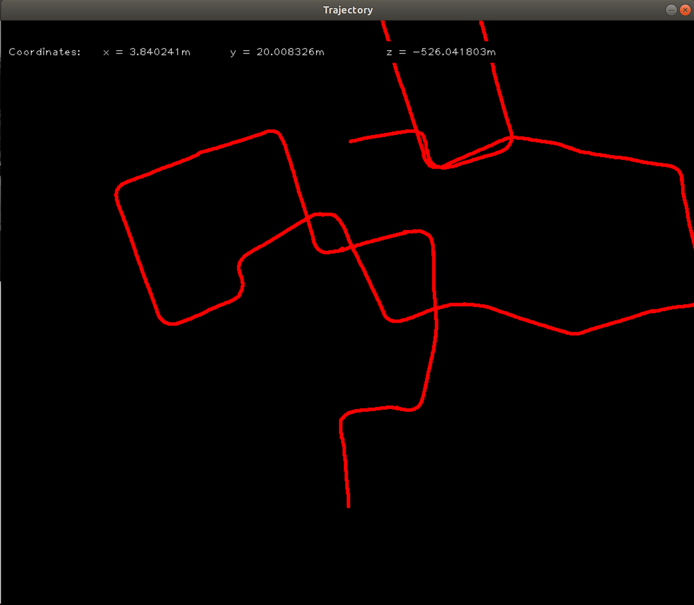

# visual-odometry

Visual Odomtery on KITTI Dataset.


<figure>
 
 <figcaption>
 <p></p> 
 </figcaption>
</figure>


## Algorithm
```
1. Read 2 images In and In+1.
2. Undistort Images.
3. Feature Detection using FAST algorithm in In and In+1.
4. Feature Descriptor extraction using ORB in In and In+1.
5. Discriptor Matching using Brute Force in the images.
6. Use Nister's 5-point algorithm with RANSAC.
7. Estimate Rotation and Translation from the essential matrix
8. Take scale information from some external source, and concatenate the translation and rotation matrix
```

## Dependencies

* `OpenCV 4.0`
* `CMake `

## Run Instructions
```
mkdir build
cd build && cmake ..
make 
cd ../bin && ./main
```

## References
```
1.http://avisingh599.github.io/vision/monocular-vo/
2.https://github.com/gaoxiang12/slambook-en
```


## Links
https://youtu.be/JgGBmD6OoAI
